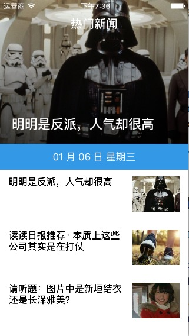
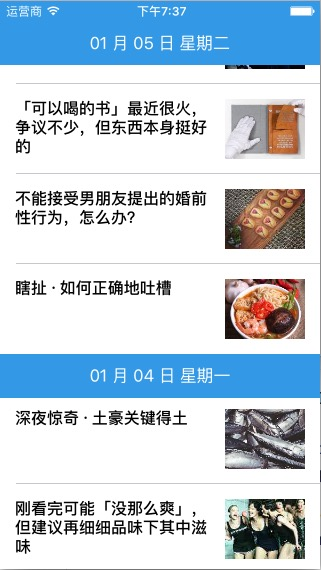
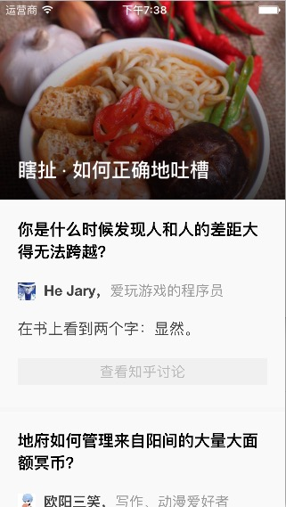

# ZhihuDaily
又一个知乎日报 iOS 客户端。

## 项目特色

- 使用 `Objective-C`
- 纯代码实现，无 `Storyboard` 和 `nib` 文件
- 没有任何第三方库的依赖
- 尽可能的实现 MVC 设计模式
- 界面设计仿照官方应用，但尽可能保持简单
- 本项目会持续更新

## API 来源

[知乎日报 API 分析](https://github.com/izzyleung/ZhihuDailyPurify/wiki/%E7%9F%A5%E4%B9%8E%E6%97%A5%E6%8A%A5-API-%E5%88%86%E6%9E%90)

## 声明

『知乎』是 知乎. Inc 的注册商标。本软件与其代码非由知乎创作或维护，软件中所包含的信息与内容皆违反版权与知乎用户协议。

## 许可证

MIT License，具体请看 `LICENSE` 文件
